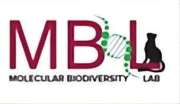

# 🐾 Animal Classifier for Camera Trap Images  



This project was developed for the **Molecular Biodiversity Lab,Ooty (MBL)** to automate species identification from camera trap images.  
It uses the **EVA02 (inat21 fine-tuned) model** from Hugging Face to classify wildlife images and exports results into a structured **Excel file** with metadata.  

---

##  Features

- Process an entire folder of camera trap images  
-  Classify animals using the EVA02-inat21 model  
-  Extract metadata (Date, Time from EXIF)  
-  Export results into **Excel (.xlsx)** with:  
  - **Animal Name** (with Google search hyperlink for cross-verification)  
  - **Block ID** (e.g., MM-073)  
  - **Camera ID** (e.g., CT-072-MC-011)  
  - **Folder Name** (animal folder)  
  - **Date & Time**  
-  Resume Later / Resume Previous operations using `progress.json`  
-  Stop & Save Now during processing  
-  Menu options to **Export from progress.json** and **Open results folder**  
-  GUI with theme + logo support (using `ttkbootstrap`)  

---

##  Installation

### Requirements
- Python 3.10+ recommended  
- Works on **Windows, macOS, Linux**  

### 1. Clone the repository
```bash
git clone https://github.com/Vysh-131/animal_df.git
cd animal_df
```
### 2. Install dependencies
```bash
pip install -r requirements.txt
```

(If you face PyTorch installation issues, install it separately following [PyTorch instructions](https://pytorch.org/get-started/locally/).)

---

##  Running the App

### Windows
```bash
python main.py
```

### macOS / Linux
```bash
python3 main.py
```

---

##  Folder Structure

```
animal_df/
│── main.py                # Main GUI application
│── requirements.txt       # Dependencies
│── LICENSE                # License for code
│── README.md              # Documentation
│── images/
│   └── logo.jpeg          # Project logo
│── output/                # Processed Excel results saved here
```

---

##  Example Output (Excel)

| Folder Name | Block   | Camera ID       | Animal Name (link) | Date       | Time     |
|-------------|---------|-----------------|--------------------|------------|----------|
| Gaur        | MM-073  | CT-072-MC-011   | [Gaur](https://www.google.com/search?q=Gaur) | 2016-01-01 | 06:30:12 |

---

##  License and Usage

This repository contains two main components:

1. **Code**  
   Licensed under the [MIT License](LICENSE).  
   You are free to use, modify, and share the code, with attribution.

2. **Model Weights**  
   This project uses the [EVA02 inat21 fine-tuned model](https://huggingface.co/timm/eva02_large_patch14_clip_336.merged2b_ft-inat21)  
   - `timm` library: Licensed under Apache 2.0  
   - iNaturalist 2021 dataset & fine-tuned models: Licensed under **CC BY-NC**  

 **Important:**  
Because of the dataset license, the pretrained EVA02-inat21 model may only be used for **research and non-commercial purposes**.  
If you intend to use this project commercially, you must replace the model with one that has a permissive license (e.g., ImageNet-pretrained models).

---

##  Credits
Developed by **Vyshakh Menon Sanil** for the **Molecular Biodiversity Lab (MBL)**.  
